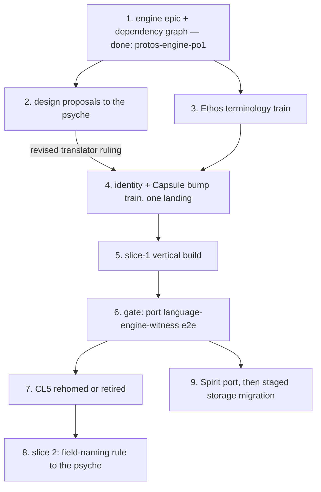

# Protos Engine Design — compiled 2026-07-28

The agglomerated current design. This document absorbs and supersedes the
derived design documents of 2026-07-26 through 2026-07-28: the 2026-07-26
compiled log's still-current substance, `CodexContextHandover-2026-07-27.md`,
`DesignVision-2026-07-28.md`, `CodexWayForward-2026-07-28.md`, and
`NamingModelBrief-2026-07-28.md`. It is a compilation, not an authority: the
firsthand design logs control every psyche wording, later statements govern
earlier ones, and where this document and a log disagree, the log wins.

Firsthand logs, in authority order (newest controls its session's wording):

1. `DesignReviewRulings-2026-07-28.md` — the naming/identity review, entries 1–11.
2. `SliceOneRulings-2026-07-27.md` — the slice-1 decisions, entries 1–11.
3. `ShapeAndSliceRulings-2026-07-26.md` — including entry 8's confirmations.

Provenance marks, on every claim:

- **[ruled]** — verbatim psyche words, character-exact from a source.
- **[confirmed]** — a restatement the psyche confirmed as his; substance
  carries his authority, wording may be an agent's.
- **[derived]** — agent-formalized standing doctrine, consistent with rulings
  but not his words. Never cited back to him as a ruling.

## The vision, in one paragraph

A family of engines — **Ethos** (the schema language, the sweet syntax),
**Nomos** (the string-free transformer), **Logos** (the encoded program) — over
one shared protos substrate, in which programs exist as **typed encoded data**:
identity is integers, never spelling; there are no field names; text —
including Rust — is only the interim interface, produced and consumed
exclusively through the name tree and the structure tree; Rust is treated as an
assembly language. Each engine is a stateful daemon with its own embedded sema
db; one small translator daemon owns naming and identity allocation. The
endgame is **operational editing** — no text editing; operations sent to the
daemon and applied atomically — and the long arc is the sema vision: a way of
thinking about data that eventually contains no strings at all. **[ruled]**
"the ultimate computer language cannot use strings, since they are an extremely
inefficient way of representing a set (which language is)".

## 1. Two organs, and text as the interim interface

TextualForm and EncodedForm — **[confirmed]** "one is a view on the other".

**[ruled]** the trees drive everything: "a nametree and a structuretree",
"textualform trait writes and reads the name and structure trees", "this
drives all textual en/decoding, including rust", "the vision even allowed
multiple textualforms per encodedform; logos -> logos or logos -> rust", "even
nota can take this architecture; it would be the basic/most-universal example."

**[confirmed]** the strict invariant (confirmed 2026-07-27 as his words):

> "nametree and structural tree from the protos library drive all the decoding
> and encoding to/from text with DATA - strict invariant. nothing else will do."

**[ruled]** one shared mechanism for all structure-based decoding, reused by
every parser, with parallel shared machinery for deparsing; "the textualform
traits should force the use of structural data". The hand-written Rust
reader/printer is being *replaced*, never *rejected* — "That's DEMANDING it".

**[ruled]** "text is the current standard programming interface; it is what we
*must* work with in order to get to the future interface".

**[confirmed]** "Exactness is structural. Values that matter semantically must
have exact representations… Errors are also structural values."

## 2. The two-pass block model

**[ruled]** in the 07-26 dictation (wording in the firsthand log): all
languages have blocks; pass 1 finds beginnings and ends by balancing
delimiters plus the dotted prefix (protos family) or by cue-opened,
rule-terminated scanning (Rust: `struct` is an inclusive cue; the end is found
by following only the termination rules, which also discovers the inner
blocks — that is the recursion). Pass 2 then does typed parsing over
content-bounded strings.

**[ruled]** the block tree is a trait — "we love traits; they make agents
smarter by giving them an ontology" (distilled: standards
`traits-as-ontology.md`). **[ruled]** strings and comments are opaque to
pass 1. **[ruled]** every block carries source bounds.

**[derived]** pass 1 is recursive block discovery driven by per-language
boundary rules only, never full grammar; the block tree is one universal
untyped shape — bounds, cue/prefix, children, content — with per-language
implementors; pass 2 is expectation-driven typed structural parsing per block,
producing EncodedForm plus NameTree — the capsule.

## 3. Structural parsing laws

**[ruled]** boundary-first: "structural parsing doesnt reacting blindly on
characters; it has a state-machine to de/parse the type by finding the outside
boundaries first, and passing through the inside of that block again and
again, recursively and structurally."

**[ruled]** the expected type carries a payload for custom structure-based
logic; the parser picks it up when non-empty.

**[ruled] 2026-07-28** token-level longest-match is law: "yes, longest-match
is law" — a token is the longest run its character class accepts. Typed
disjointness and conservative refusal govern everything above the token level.
This closed former open question 8.

**[derived]** conservative refusal: disjointness is proven over typed
positions; what cannot be proven disjoint is rejected; proof power is gained
through types, never by weakening the check. Stop-the-line on undecidable
cases — surfaced, never order-resolved, never special-cased.

**Fidelity guard:** do not carry "explicitly denies horizontal parsing" as a
quote; no source contains it.

## 4. Typed data laws

**[ruled]** "wtf is this garbage? Thats a vector of strings, not typed data! it
should be fully typed struct." — grammar rules are fully typed records with
typed positions (fork ruled "1"). Spellings live as data **on** typed
positions (ItemKeyword carries "struct"), never as bare strings in a sequence.

**[derived, ratified-adjacent]** the R2 requirements: rust-logos defines a
typed rule vocabulary run by the *same* shared evaluator — a second driven
vocabulary, not a parallel engine, not hand-written match arms.

**[derived standing law]** no `syn`, `quote`, or `prettyplease` anywhere on
the pipeline — grounded in his rulings; he never said the crate names; do not
attribute the sentence to him.

**[ruled]** one concession: one hand-written Rust-specific evaluator object is
permitted as MVP — "sure, if you think that's a good first MVP".

## 5. Names and identity — the current model (2026-07-28)

The model of DesignReviewRulings entries 1–11, which supersedes every earlier
naming rendering (the per-component tables of 07-19, the flat unified table
reading of 07-27, and the flat global lexicon reading of earlier 07-28
entries).

**[confirmed]** the nested-table model (entry 10):

```
root module's table          each module owns the table of its members;
  1 <-> "billing"  (module)  the module itself is an entry in its
  2 <-> "tasks"    (module)  container's table, recursively
  3 <-> "Integer"  (builtin)

billing's table              tasks' table
  1 <-> "Status"               1 <-> "Status"    different thing,
  2 <-> "Invoice"                                different table, no clash
```

- **[ruled]** "encoded IDs are by module which the module also has an encoded
  ID." A thing's full identity, and every encodedform reference, is the chain
  of module-allocated encodedIDs (billing's Status above is 1.1; tasks' is
  2.1) — integers only, all the way down.
- **[ruled]** terminology: the durable identity is the **encodedID** ("since
  its encodedform, encodedID is appropriate"); it is not separate from the
  thing's durable identity — "I didnt think of the durable identity as
  separate from its coreID". The code's current name for it is `Identifier`;
  the rename rides the terminology train. Matches **[ruled] 07-22** "encoded
  identity is the only durable one".
- **[ruled]** allocation: "nothing declares the coreID, the coreID is
  allocated by the translator on receiving an unallocated word" — refined by
  the nested model: unallocated *in that module's table*. No other minting
  act exists. **[ruled] 07-17** "if it got re-ID'ed then its not the same".
- **Rename** (entries 5–6): **[ruled]** the real naming problem is
  programmatic rename — "we're talking about statuses that are not the same
  status, but both use the name status"; **[ruled]** renaming extends to the
  container: "the same concept of programmatic renaming becomes possible for
  the domain too… free renaming both on the specific string in that module
  and the module name itself." Rename is a one-entry spelling edit in the
  owning module's table, identical at member and module level; identity and
  references never move. The endgame frame: **[ruled]** "you're not going to
  be editing text. You're going to be doing operational editing. You're going
  to send operations, and it'll all be atomically edited in the daemon. And
  that's when we'll have the renaming operation." **[ruled]** (entry 12) a
  rename performed by editing text is accepted as identity-breaking — the
  next seal mints a fresh encodedID and orphans the old entry; only the
  operational rename preserves identity; the translator code carries a note
  of this mechanic at the allocation site.
- **Kinds of names** (entry 4): **[ruled]** "it's not a conflict if you have a
  variant in front of the ID, because they're not the same nametable." The
  split criterion is vocabulary sharedness; translator-based renaming can only
  operate on universally shared vocabulary. Words-as-values — language
  vocabulary (Rust keywords, std names) and dynamic-enum value words — never
  rename: their spelling is their substance. The variant set is undesigned
  matter.
- **Exactness** (entry 2): the tables are exact and case-sensitive —
  **[ruled]** `17 <-> "public"`, `18 <-> "Public"`: different entries. No
  canonicalization, casing, or normalization in any table; all derivation
  lives in the projection layer, evaluated only at TextualForm.
- **Uniqueness rationale** (entry 11): **[ruled]** per-module spelling
  uniqueness matches "how the parser of a standard programming language
  works… it's not because the model is constrained like that necessarily,
  it's just because that's what we're constrained by, by virtue of what we're
  trying to go to and from." Inherited from the interface, not intrinsic; do
  not build anything that depends on it being a deep invariant. The
  redefinition error — **[ruled] 07-22** "it should be an error, whenever
  anything tries to define something already defined, like builtins" — lands
  at universe seal and means: the same spelling twice in one module's table.
- **Emission** (entry 7): **[ruled]** "we use the coreID for the emitted rust
  (a textual version of it - some kind of textual binary encoding which is
  friendly to rustc)." Emitted Rust identifies our things by an encoding of
  the encodedID chain — rename-proof by construction; Rust's own vocabulary
  keeps Rust's spellings. Encoding scheme: matter, undesigned. Recorded
  tension with **[ruled] 07-23** "keep the generated artifacts as accessible
  as possible"; mitigations (regenerated doc comments) are matter.
- **Content hashing** (entry 8): **[ruled]** only hashing "the entire capsule
  after it is fully encoded" was ever discussed; recursive leaf-first
  per-thing hashing "would be great, but we never discussed it" — unruled, do
  not build. core-logos's per-item `content_identity()` stands on
  implementation, not ruling; reconcile in the identity-train proposal.
  Capsule-level identity is **[ruled]** `Variant.ContentAddressedHash`,
  **[ruled]** "Variant-only": kind solely in the outer variant, pure-content
  preimage; digests move on the one bump train.
- **[ruled]** no field names, anywhere: "ALL FIELDS ARE POSITIONAL! … field
  names are now COMPLETLY ILLEGAL EVERYWHERE". Fields are deterministically
  named in the conversion to textualform.
- **[ruled]** name projections are his standing design ("I thought that's
  what I had designed"): derived text is a typed algebra over identifiers
  (Exact, Cased, Composed, Disambiguated), evaluated only at textualform
  time; disambiguation keys on type identity, never derived spelling; no
  string anywhere in the algebra. Landing this algebra is a prerequisite of
  the rename operation: the current implementation interns derived spellings
  early (the inversion), which makes rename structurally impossible.
- **[ruled]** "no aliases". **[ruled]** EncodedForm has no concept of files;
  filenames are a beautification algorithm (his hedge kept: "if im not
  mistaken").
- **[ruled]** short identifiers are display operations, never state: "it's a
  full content-addressed hash. the short identifiers is for common display
  operations… the 4 or more chars shortened version that doesnt conflict in
  the db"; kind-distinct short-code types ("they should be a different type
  for sure").

**Terminology guard:** the container's working term is **module**; never
"domain" — the word is four-times taken for hash separation, and the
term-overload law forbids it (**[ruled]** "There can be no sema-storage
daemon, as it would overload the term sema").

## 6. Daemon architecture

**[ruled] 2026-07-27**: "sema is the database of each daemon. either you are
mistaken, or the implementation is. each daemon is stateful". The 2026-07-17
"seat it centrally in sema" was overruled and mis-voiced — "I shouldnt have
said "in sema", since all daemon state lives in *its* sema db. There can be no
sema-storage daemon". **[ruled]** the nametable authority is its own small
daemon ("a, its own small daemon"). **[derived]** working name
sema-translator — a leaning, not a fixed name; the durable identity-authority
laws (never re-mint, never rebind) reseat into it; sema-storage's
stateless-client architecture is dead law and the repo cannot keep its name.

**The translator-daemon proposal state (2026-07-28):** the operational frame
is approved — sole writer, atomic idempotent universe sealing, typed
authorization and failures, no distributed transaction, engines caching
verified immutable snapshots, spelling-identity distinct from declared-type
identity. Its stored-state model must be revised to the nested module tables
and encodedID chains of section 5 before code, with the rename operation in
the contract and module-scoped lookup replacing name-table's flat word→ID
index (`NameIndexCollision` is off-model; do not fix it in place). The revised
stored-state section returns as a design proposal before implementation.

## 7. The sema vision — intent

**[ruled] 2026-07-27**, psyche-initiated (verbatim in full in SliceOneRulings
entry 5): sema "means more than just a database. It's a new way of thinking
about data, which doesn't contain strings eventually." Single words become
dynamically assigned enums — spelling-constrained, stored as integers through
the translator. Long prose stays strings for now ("a very, very long-term
thing"). **[ruled]** dynamic enums "could later be re-compiled into proper
enums, while keeping their place in the translator table". **[ruled]** the
no-strings end-state: "almost, if it is extracted into a universal. the
ultimate computer language cannot use strings…". **[ruled]** standing
preference: "something to distill into standards; which I want to lean on
more, and use more now."

## 8. Capsule

**[ruled]** the 07-23 dictation (wording in the compiled sources): a capsule
per namespace mirrors the file concept; conflicts are dealt with at each
layer; emitted Rust is always fully qualified — "we treat Rust like an
assembly language" — so the compiler can never see a naming problem; the
top-level capsule is the manifest; capsules are otherwise homogeneous, each
able to declare executable/library and public/private sub-namespaces; Logos
accommodates Rust without following it exactly.

**[ruled] 2026-07-27** the container is a **generic struct** — kind as a type
parameter, kind-distinct types by construction. **[ruled]** the name is
"Capsule". **[ruled]** a capsule pins the complete composition of its
nametree. **[ruled] 07-25** rust-logos gets no capsule; the textualform
association object is *fixed* to a capsule kind — with his own reopening ("OR,
rust has also a capsule…?") still open. **[ruled]** capsule and
short-identifier are protos concepts — protos traits with per-engine
implementations. **[ruled]** capsule-to-crate correspondence is optional,
driven by generated-artifact accessibility. **[ruled]**
"content-identity is that library — add ShortCode to it" (the stored ShortCode
value model has since died under the display-operation ruling; the library
seat stands).

**Open (2026-07-28):** how the module tables of section 5 relate to the
capsule's pinned composed nametree, and whether capsule identity is minted or
derived — decisive for parts of the capsule contract; unruled.

## 9. Ethos — the names

**[ruled] 2026-07-27** the schema language is **Ethos** ("yes, ethos"):
Ethos → Nomos → Logos. Repo renames directed and executed, verified on disk:
core-ethos, ethos-engine, signal-ethos, tree-sitter-ethos; GitHub redirects
live; crate/type/pin renames ride the correction train. **[ruled]** NOTA keeps
its name ("nota is fine"). Naming constraints from the exercise: "the -os isnt
a constraint", "we arent tied to greek", "no, not english", "eidos isnt very
evocative for english speakers".

## 10. Pipeline

**[ruled]** "schema is the sugar, sweet syntax" — a dedicated declaration
surface. **Recorded contradiction, unreconciled:** the same day's "make them
the same thing - exceptions are symptoms of bad design". Recency gives sugar
the floor; do not resolve by inference.

**[ruled]** the no-strings nomos invariant: "in the nomos transformation
(schema to logos), there shall be *no string manipulation/introduction/reading
of any kind*", with walkers at the boundary ("that is necessary.").
**[confirmed]** "transformers are data".

**[ruled]** the manifest is a nota config associating files to top-level
namespaces with rust-like directory resolution rules — his own open flag: "we
can generate rust with modern syntax schema? <- big question actually".

**[derived]** there is no logos source: logos is produced by nomos from ethos,
never authored as text.

## 11. The ratified item schema

The full typed item block (reproduced exactly in the 2026-07-27 handover
sources and ratified 07-22) stands under **[ruled]** "otherwise I like the
syntax." — **what "otherwise" excepted was never recovered**; the ratification
is conditional on something unnameable and must be flagged wherever the block
is relied on. Supporting rulings: every item kind takes the brace payload; the
first field is the identifying subject, realized positionally; `Field` carries
no name; the escape set is closed at two primitives (`$x` realizes, `$@xs`
splices — "agreed").

## 12. Topology

**[ruled]** micro-repos only: "we dont use the monorepo style", "the
consolidation was never approved". **[ruled]** protos.git holds the common
daemon traits; protos-engine is "a new ASSEMBLY repo, not an engine source
repo" — nix, launch scripts, tests. **[derived]** the dependency-sink law:
nothing links against protos-engine; its micro-repo deps are published git
revs, never path deps. Repositories live at the ghq root; standards live in
LiGoldragon/standards.

## 13. Acceptance

**[ruled]** "I dont care about byte-exactness. get rid of that. working
programs is what we want." **[ruled]** "near roadmap is getting everything
running on the new protos engine and testing the hell ouf of it."
**[confirmed]** the spirit-port test: Spirit on the new engine against an
isolated migrated copy of production data, zero schema-rust dependency, no
compatibility adapters. **[derived]** vertical slices, each compiling and
running the generated Rust; witness oracle — scratch crate, real cargo
compile, behavior round-trips, no byte-golden.

## 14. Implementation state — verified 2026-07-28

Verified against published mains (read `origin/main`; working trees were
synced to main by Codex on 2026-07-28).

Standing gaps (all confirmed):

- content-identity hashes a domain context and LayoutVersion into the
  preimage — Variant-only unimplemented; the composed-nametree preimage moves
  in the same retype.
- protos has a closed `CapsuleKind` enum and trait-with-KIND, not the ruled
  generic struct. The Rust-capsule foreclosure (`compile_fail` doctest) is
  **correct** under the standing 07-25 ruling — do not remove it while open
  question 7 stands.
- No core component implements Capsule; core repos pin protos revisions
  predating the Capsule crate — repin precedes implementation.
- No whole-logos identity kind exists.
- textual-rust uses syn/quote/prettyplease on production paths.
- core-nomos routes every apply through string-bearing machinery
  (NameTableBoundary, case builders, ordinal words, prelude render); the
  no-strings law is honored exactly one file deep. `SameTypeOrdinal`
  (English number-words disambiguating same-typed fields by spelling) is the
  clearest violation of the projection design. Early interning of derived
  spellings makes rename structurally impossible — the projection algebra is
  a prerequisite.
- raw-discovery has no Rust cue-to-termination variant; seed it from the live
  `discover_delimited_with` / `BlockCue` machinery (the balanced-scan core is
  live; only the public wrapper is test-only). ~970 lines of the superseded
  span-free recognizer still ship, unused.
- The two-pass decode path itself is clean: all four refusal grounds of the
  old recognizer are gone; refusal is proven at table-seal time. One dirty
  spot: core-ethos's document splitter (positional `roots[i]` against
  `DOCUMENT_SLOTS=6`, literal `source.trim() == "{}"` check) — a missing
  typed document grammar.
- protos-engine's gate proves only the old Spirit PublicTextSearch witness.
  A working proof of the new chain exists in `language-engine-witness`
  (e2e: decode → Nomos → Logos → emit → compile → run, with durability
  pass) — the gate work is porting it, not building from scratch.
- Ethos rename residue: ~590 "schema" occurrences across four repos; crate
  names, types, and cross-repo pins still carry old names.
- Conformance Law 5 remains homeless — carry in every slice report until
  rehomed or retired by ruling.
- Spirit's corrected harness commit is preserved under
  `preserve/new-schema-port-acceptance-harness-20260728`.

Stale claims — plan no work for these: the protos↔content-identity ShortCode
break (closed by the earlier bump train) and the 29-file unpushed commit
(none exists).

**Poisoned documents — correct before subagents read them:**
`raw-discovery/ARCHITECTURE.md` ("Structure is span-free" presents the
refused model as canon), `core-nomos/ARCHITECTURE.md` (relabels 1,892-line
`generation.rs` as "the emission boundary", a license to bypass the
no-strings rule), `sema-storage/ARCHITECTURE.md` and
`ethos-engine/ARCHITECTURE.md`/`AGENTS.md` (overruled central-daemon law).

## 15. The way forward



1. Groundwork is done and verified: workspaces synced, Spirit commit
   bookmarked, epic `protos-engine-po1` (11 children) published.
2. Design proposals before code, one at a time, each explained in practice
   (storage, sharing, failure paths — SliceOneRulings entry 10): the revised
   translator stored-state (nested tables, chains, rename operation), the
   root table's variant set, staged sema-storage dissolution (including the
   dead-law doc corrections).
3. Behavior-free Ethos terminology train (~590 occurrences, plus cross-repo
   pins), before new work deepens the residue.
4. One identity + Capsule bump train: content-identity Variant-only retype
   (pure-content preimage, composed-nametree preimage, whole-logos variant) →
   translator contract → protos generic-struct Capsule (Rust-capsule
   enforcement stays) → core repins + first implementors → fresh digest
   locks, one landing, producer-first.
5. Slice-1 vertical: Rust cue-to-termination discovery → typed Rust
   descriptors (same shared evaluator) → rust-logos (no syn/quote/
   prettyplease on the slice path) → Ethos six-slot newtype with builtin
   priors → direct string-free core-nomos converter (never through
   NameTableBoundary, macros, prelude, renderer, projection, ordinals) →
   whole-logos identity → structural Rust emission by encodedID encoding.
6. Gate: port the language-engine-witness e2e into protos-engine's check-all;
   keep the old PublicTextSearch witness until the Spirit port lands.
7. Conformance Law 5: rehome or retire by ruling before the slice closes.
8. Slice 2 opens by presenting the deterministic field-naming rule for
   ratification; the projection algebra is the vocabulary, not the answer.
9. Spirit port after the gate passes; storage migration one daemon at a time;
   old topology retired last. Sequencing judgment (naming authority early,
   storage migration late) is agent judgment the psyche has not ruled.

## 16. Conduct and authority

- Psyche words are design and are never edited. Logs are append-only;
  supersede by appending. Later statements govern earlier ones.
- Open questions are answered by the psyche, never by code.
- Every question put to the psyche is explained in practice — where a thing
  is stored, how it is shared, what happens on failure paths. A yes/no
  wrapped around an undesigned mechanism gets sent back. **[ruled]** "am I
  supposed to understand this? Do you? Like *actually understand* what that
  means in practice?"
- Never write a comment or test name claiming a ruling is satisfied; describe
  mechanics. Deleted coverage is named, never silent.
- Stop-the-line on undecidable disjointness. Behavior changes named in their
  own commit bodies; law-widening in its own commit, citing the authorizing
  reason.
- Repository work: jj only with inline messages; Orchestrate claims before
  shared edits; worktrees via RequestWorktree/ConcludeWorktree; repos at the
  ghq root.
- Preserved external work — do not touch: the frozen Meta and Judge candidate
  worktrees, the Spirit worktree and published feature branches,
  structural-codec-derive, signal-frame wire primitives.

## 17. Open questions — do not infer

Closed this session: the global longest-match law (now law, token level); the
identity crux (the encodedID is the durable identity; nested module tables);
the homonym/conflict question (dissolved by the nested model).

1. Function-parameter and let-binding names (nearest word: let statements are
   "semi-anonymous (very private) types").
2. Micro-capsule: full pin or light pair ("might need").
3. Manifest self-generation — his own "big question actually".
4. reify/reflect: eventually derived? No psyche words exist.
5. StringLiteral remedy: `NameLiteral(Identifier)` vs rename-instability —
   the rename model of section 5 bears on this; close it by the same ruling.
6. Plane vocabulary survival — deferred until daemon emission.
7. His reopened question: does Rust get a capsule as a different syntax for
   logos? (Standing law until answered: no Rust capsule.)
8. What "otherwise" excepted in the item-schema ratification.
9. ID retirement policy.
10. The translator daemon's final name; the root table's variant set (schema.org
    borrowing floated).
11. The encodedID chain encoding scheme for emitted Rust.
12. The **move** operation (re-parenting between modules) — follows from
    operational editing; unruled.
13. Module ↔ capsule relation; capsule identity minted or derived.
14. Whether dynamic-enum members become things with their own encodedIDs.
15. The final term for the container ("module" is the working term).

## 18. Carried facts and registers

Substance absorbed from the eliminated documents that lives nowhere else
current.

**Foundation pins** (2026-07-27, all verified resolving; repo names current):
content-identity `24b43bae5d9748b0e7f679c6ec9f85a643c4d36a`; name-table
`196610e2907687dcb8dbd0d2dfaafe4aefd9fa27`; raw-discovery
`2ac78f621980fa02daa3b31e90cc5c73570eed6e`; structural-codec
`23497c43f81b619158e5cfbd83a012eb63c4186f`; protos
`a18810c819a4e7c09ea70ea1eef83d6a18a732d9`; core-ethos
`6067b526ab0e9c0e90389543de03d2cd7bd6202a`; core-logos
`5b66127de26b265e17a8060d5e06b9d7d31ce93e`; core-nomos
`e0a375a8a699b938033349f1c40f6e80f6e688e6`; textual-rust
`1bd10fcb47bfa510d7911a748a08715fc372a109`; protos-engine design head advances
with this repository.

**The NameProjection sketch** [derived; the concrete variant set is matter]:

```
NameProjection.[ Exact.Identifier
                 Cased.{ CaseForm Identifier }
                 Composed.Vector.Segment
                 Disambiguated.{ NameProjection Ordinal } ]
Segment.[ Name.Identifier Projected.NameProjection ]
CaseForm.[ Snake Screaming Pascal ]
```

Composition prefixes are Identifiers; no string anywhere in the algebra; the
evaluator lives on name-table's dormant TextualProjection surface;
per-language spelling data is textualform data owned by rust-logos, never
nomos.

**The short-identifier model** [derived from the 07-26 rulings]: a display
method on the content hash taking a resolver of known hashes, solving for the
shortest non-conflicting rendering, minimum 4 characters, growing as needed;
git short hashes are the model. The stored ShortCode value model is dead in
full: the numeric type, the mint, the rkyv adapters, the archive locks, the
kind-typed stored variants, and protos' ShortIdentifier supertrait.

**Carried mapped facts**: `EncodedReference::Integer` takes a typed identifier
drawn from the builtin priors, never manufactured from the text "Integer";
the one-newtype conversion transfers the declaration identifier, maps item
visibility, and emits empty attributes; generated Rust may be attribute-free;
the behavior crate may define `type Integer = u64` and round-trip through
`.0`; the production schema source is the six-slot document decoding one
newtype wrapping builtin Integer.

**Codex-root conduct**: the root session coordinates only — repository work
goes through subagents; long interruptible waits, never repeated short waits.
Every behavior change is named in its own commit body; plumbing commits carry
zero behavior; mechanically-checked laws are widened only in their own
commit, citing the authorizing reason.

**Deliberately deferred, not forgotten**: textual-rust runtime/golden/nix
tests; core-nomos runtime and nix tests; spirit, meta, judge, signal-frame;
slice 2 and beyond.

**Cleanup debt** (verified 2026-07-27): three stale worktrees under old
repository names in `~/wt/github.com/LiGoldragon/`; 16 old-name entries in
`/home/li/primary/orchestrate/worktrees.nota`. GitHub redirects keep old
names working meanwhile.

**Boundary notes**: referent aliases — the Spirit-domain concept of alternate
names for real-world subjects — are not addressed by "no aliases" either way.
The manifest: the compiled log carries its shape as open; the 07-19 handover
carries **[ruled]** "yes, full explicit manifest. dont ignore the types the
machine wants - everything is typed data"; the 07-23 manifest ruling governs
by recency.

**One only-carrier quote absorbed** from the eliminated vision document —
**[ruled] 2026-07-27**, the instruction that created the corrected handover:
"audit it, then create a better version, with a more complete and accurate
psyche vision".

**Live register, kept, not absorbed**:
`reports/BadDataShapesRegister-2026-07-26.md` — ~65 defect entries plus bugs
L1–L8 with locations and typed replacements, mostly unfixed, reproduced
nowhere else. Its tier sequencing is stale; the register is not.

## 19. References

Firsthand authority, in order: `DesignReviewRulings-2026-07-28.md`,
`SliceOneRulings-2026-07-27.md`, `ShapeAndSliceRulings-2026-07-26.md`.

Kept as quote-carrying archive (never edit, never delete):
`ProtosEngineDesign-2026-07-26.md` — the prior compilation, sole carrier of
the ratified item schema block and the 07-19→25 ruling era; and the whole of
`/home/li/primary/reports/logos/` and `/home/li/primary/reports/schema/` —
the firsthand archive of the 2026-07-11→21 design era (the three psyche
handovers, `textual-form-vision-design-v1.md`,
`samples/v2-psyche-base.logos`, and ~25 further files carrying only-carrier
psyche verbatim). This document supersedes the 07-26 compilation as the
current compilation without replacing it as an archive.

Eliminated by this compilation, recoverable from primary's history (snapshot
commit precedes deletion): `CodexContextHandover-2026-07-27.md`,
`DesignVision-2026-07-28.md`, `CodexWayForward-2026-07-28.md`,
`NamingModelBrief-2026-07-28.md`, `CodexCorrection-2026-07-26-second.md`,
`CodexCourseCorrection-2026-07-26.md`, `ShortIdentifierRuling-2026-07-26.md`,
`CodexResumePrompt-TypedRules-2026-07-26.md`,
`CodexShapeRemediation-2026-07-26.md`.
