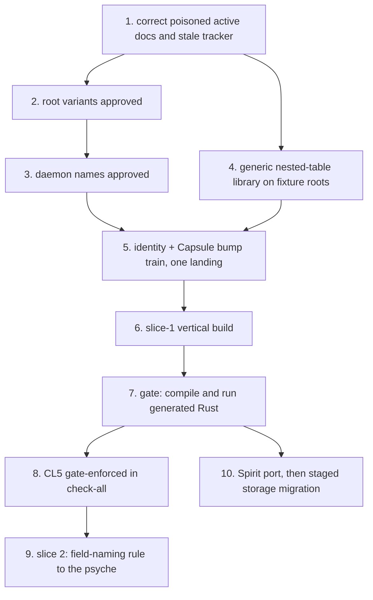

# Protos Engine Design — compiled 2026-07-29

The agglomerated current design. This document absorbs and supersedes the
2026-07-28 compilation and integrates the recovered nomos authoring vision,
the triple-language vision statement, the transformer crux rulings, and the
Template(X) delegated assent of 2026-07-29. It is a compilation, not an
authority: the firsthand design logs control every psyche wording, later
statements govern earlier ones, and where this document and a log disagree,
the log wins.

Firsthand logs, in authority order (newest controls its session's wording):

1. `PsycheVisionReacquisition-2026-07-29.md` — the 07-29 session, entries 1-6.
2. `DesignReviewRulings-2026-07-28.md` — the naming/identity review, entries 1-17
   (session 07-28, with entry 17 continued 07-29).
3. `SliceOneRulings-2026-07-27.md` — the slice-1 decisions, entries 1-11.
4. `ShapeAndSliceRulings-2026-07-26.md` — including entry 8's confirmations.
5. `RecoveredNomosVision-2026-07-29.md` — recovered firsthand quotes (original
   sessions 07-11 through 07-22, compiled 07-29); the oldest material,
   governing only where no later log addresses the same question.

Provenance marks, on every claim:

- **[ruled]** — verbatim psyche words, character-exact from a source.
- **[confirmed]** — a restatement the psyche confirmed as his; substance
  carries his authority, wording may be an agent's.
- **[delegated assent]** — an agent-proposed mechanism the psyche authorized
  from its explanation without reading the underlying proposal. It may be
  implemented, but is never cited back as his independent conviction and must
  be re-explained on request.
- **[derived]** — agent-formalized standing doctrine, consistent with rulings
  but not his words. Never cited back to him as a ruling.

## The vision, in one paragraph

Three languages — **Ethos** (the sweet syntax, the declaration surface),
**Nomos** (the transformer language), **Logos** (the encoded program, the
assembly truth) — over one shared **protos** substrate, in which programs
exist as **typed encoded data**: identity is integers, never spelling; there
are no field names; text — including Rust — is only the interim interface,
produced and consumed exclusively through the name tree and the structure
tree; Rust is treated as an assembly language. All three languages, plus NOTA
as the foundational fourth, use the same protos mechanism to load to and from
textual form into encoded form; they have their own syntax but look similar —
they are all protos-family languages. The textual style shared by the family
is named **protos** (PsycheVisionReacquisition entry 3). Each engine is a
stateful daemon with its own embedded sema db; one small translator daemon
owns naming and identity allocation. Nomos is there to create the sugar
syntax of Ethos, and Logos is there to give a true representation of the
assembly language; the entire reason Nomos exists is so that the
transformation can be modified using the Nomos language. **[ruled]**
(PsycheVisionReacquisition entry 4):

> "the entire reason why we have nomos is so that we can modify the
> transformation using the nomos language. So if the nomos language was never
> implemented, then the entire engine is currently a failure because the whole
> point of creating nomos was to be able to modify."

The endgame is **operational editing** — no text editing; operations sent to
the daemon and applied atomically — and the long arc is the sema vision: a
way of thinking about data that eventually contains no strings at all.
**[ruled]** "the ultimate computer language cannot use strings, since they are
an extremely inefficient way of representing a set (which language is)".

## 1. Two organs, and text as the interim interface

TextualForm and EncodedForm — **[confirmed]** "one is a view on the other".

**[ruled]** the trees drive everything: "a nametree and a structuretree",
"textualform trait writes and reads the name and structure trees", "this
drives all textual en/decoding, including rust", "the vision even allowed
multiple textualforms per encodedform; logos -> logos or logos -> rust", "even
nota can take this architecture; it would be the basic/most-universal example."

**[confirmed]** the strict invariant (confirmed 2026-07-27 as his words):

> "nametree and structural tree from the protos library drive all the decoding
> and encoding to/from text with DATA - strict invariant. nothing else will do."

**[ruled]** one shared mechanism for all structure-based decoding, reused by
every parser, with parallel shared machinery for deparsing; "the textualform
traits should force the use of structural data". The hand-written Rust
reader/printer is being *replaced*, never *rejected* — "That's DEMANDING it".

**[ruled]** "text is the current standard programming interface; it is what we
*must* work with in order to get to the future interface".

**[confirmed]** "Exactness is structural. Values that matter semantically must
have exact representations… Errors are also structural values."

## 2. The two-pass block model

**[ruled]** in the 07-26 dictation (wording in the firsthand log): all
languages have blocks; pass 1 finds beginnings and ends by balancing
delimiters plus the dotted prefix (protos family) or by cue-opened,
rule-terminated scanning (Rust: `struct` is an inclusive cue; the end is found
by following only the termination rules, which also discovers the inner
blocks — that is the recursion). Pass 2 then does typed parsing over
content-bounded strings.

**[ruled]** the block tree is a trait — "we love traits; they make agents
smarter by giving them an ontology" (distilled: standards
`traits-as-ontology.md`). **[ruled]** strings and comments are opaque to
pass 1. **[ruled]** every block carries source bounds.

**[derived]** pass 1 is recursive block discovery driven by per-language
boundary rules only, never full grammar; the block tree is one universal
untyped shape — bounds, cue/prefix, children, content — with per-language
implementors; pass 2 is expectation-driven typed structural parsing per block,
producing EncodedForm plus NameTree — the capsule.

## 3. Structural parsing laws

**[ruled]** boundary-first: "structural parsing doesnt reacting blindly on
characters; it has a state-machine to de/parse the type by finding the outside
boundaries first, and passing through the inside of that block again and
again, recursively and structurally."

**[ruled]** the expected type carries a payload for custom structure-based
logic; the parser picks it up when non-empty.

**[ruled] 2026-07-28** token-level longest-match is law: "yes, longest-match
is law" — a token is the longest run its character class accepts. Typed
disjointness and conservative refusal govern everything above the token level.
This closed former open question 8.

**[derived]** conservative refusal: disjointness is proven over typed
positions; what cannot be proven disjoint is rejected; proof power is gained
through types, never by weakening the check. Stop-the-line on undecidable
cases — surfaced, never order-resolved, never special-cased.

**Fidelity guard:** do not carry "explicitly denies horizontal parsing" as a
quote; no source contains it.

## 4. Typed data laws

**[ruled]** "wtf is this garbage? Thats a vector of strings, not typed data! it
should be fully typed struct." — grammar rules are fully typed records with
typed positions (fork ruled "1"). Spellings live as data **on** typed
positions (ItemKeyword carries "struct"), never as bare strings in a sequence.

**[derived, ratified-adjacent]** the R2 requirements: rust-logos defines a
typed rule vocabulary run by the *same* shared evaluator — a second driven
vocabulary, not a parallel engine, not hand-written match arms.

**[derived standing law]** no `syn`, `quote`, or `prettyplease` anywhere on
the pipeline — grounded in his rulings; he never said the crate names; do not
attribute the sentence to him.

**[ruled]** one concession: one hand-written Rust-specific evaluator object is
permitted as MVP — "sure, if you think that's a good first MVP".

## 5. Names and identity — the current model (2026-07-28)

The model of DesignReviewRulings entries 1-17, which supersedes every earlier
naming rendering (the per-component tables of 07-19, the flat unified table
reading of 07-27, and the flat global lexicon reading of earlier 07-28
entries).

**[confirmed]** the nested-table model (entry 10):

```
root module's table          each module owns the table of its members;
  1 <-> "billing"  (module)  the module itself is an entry in its
  2 <-> "tasks"    (module)  container's table, recursively
  3 <-> "Integer"  (builtin)

billing's table              tasks' table
  1 <-> "Status"               1 <-> "Status"    different thing,
  2 <-> "Invoice"                                different table, no clash
```

- **[ruled]** "encoded IDs are by module which the module also has an encoded
  ID." A thing's full identity, and every encodedform reference, is the chain
  of module-allocated encodedIDs (billing's Status above is 1.1; tasks' is
  2.1) — integers only, all the way down.
- **[ruled]** terminology: the durable identity is the **encodedID** ("since
  its encodedform, encodedID is appropriate"); it is not separate from the
  thing's durable identity — "I didnt think of the durable identity as
  separate from its coreID". The code's current name for it is `Identifier`;
  the rename rides the terminology train. Matches **[ruled] 07-22** "encoded
  identity is the only durable one".
- **[ruled]** allocation: "nothing declares the coreID, the coreID is
  allocated by the translator on receiving an unallocated word" — refined by
  the nested model: unallocated *in that module's table*. No other minting
  act exists. **[ruled] 07-17** "if it got re-ID'ed then its not the same".
- **Rename** (entries 5-6): **[ruled]** the real naming problem is
  programmatic rename — "we're talking about statuses that are not the same
  status, but both use the name status"; **[ruled]** renaming extends to the
  container: "the same concept of programmatic renaming becomes possible for
  the domain too… free renaming both on the specific string in that module
  and the module name itself." Rename is a one-entry spelling edit in the
  owning module's table, identical at member and module level; identity and
  references never move. The endgame frame: **[ruled]** "you're not going to
  be editing text. You're going to be doing operational editing. You're going
  to send operations, and it'll all be atomically edited in the daemon. And
  that's when we'll have the renaming operation." **[ruled]** (entry 12)
  "accept it, and make a note of it in the code." **[derived]** From that
  ruled choice, a rename performed by editing text is identity-breaking: the next
  seal allocates a fresh encodedID and leaves the old entry allocated but
  orphaned. The operational rename is the sole identity-preserving path at
  member and module level. A textual module rename therefore re-mints its
  descendant subtree. The allocation site carries a description of this
  behavior, never a claim that a ruling is satisfied.
- **Kinds of names** (entry 4): **[ruled]** "it's not a conflict if you have a
  variant in front of the ID, because they're not the same nametable." The
  split criterion is vocabulary sharedness; translator-based renaming can only
  operate on universally shared vocabulary. Words-as-values — language
  vocabulary (Rust keywords, std names) and dynamic-enum value words — never
  rename: their spelling is their substance. The variant set is undesigned
  matter. **[ruled]** (entry 13) "we have no control over rusts internal
  names, so they are immutable… yes, mutability per table." The psyche's
  "it could be a field in a top level struct of each table" is a leaning on
  placement, not the grade of the per-table ruling. **[confirmed]** In the
  approved implementation mechanism, `ModuleTableHead` carries that field.
  Rename against an immutable table fails typed before any entry lookup.
- **Exactness** (entry 2): the tables are exact and case-sensitive —
  **[ruled]** `17 <-> "public"`, `18 <-> "Public"`: different entries. No
  canonicalization, casing, or normalization in any table; all derivation
  lives in the projection layer, evaluated only at TextualForm.
- **Uniqueness rationale** (entry 11): **[ruled]** per-module spelling
  uniqueness matches "how the parser of a standard programming language
  works… it's not because the model is constrained like that necessarily,
  it's just because that's what we're constrained by, by virtue of what we're
  trying to go to and from." Inherited from the interface, not intrinsic; do
  not build anything that depends on it being a deep invariant. The
  redefinition error — **[ruled] 07-22** "it should be an error, whenever
  anything tries to define something already defined, like builtins" — lands
  at universe seal and means: the same spelling twice in one module's table.
- **Emission** (entries 7 and 17): **[ruled]** "we use the coreID for the emitted rust
  (a textual version of it - some kind of textual binary encoding which is
  friendly to rustc)." Emitted Rust identifies our things by an encoding of
  the encodedID chain — rename-proof by construction; Rust's own vocabulary
  keeps Rust's spellings. **[ruled] 2026-07-29** fixed-width decimal is
  rejected as "a lame format" and "the most inefficient and reader unfriendly
  format imaginable"; **[ruled]** the direction had already been answered and
  asking for another psyche ruling failed to locate psyche vision. The exact
  reversible codec — radix, alphabet, delimiters, and packing — is
  implementation matter, not an open psyche design question. It must encode
  the complete variant-fronted chain in a compact, readable textual-binary
  form accepted by rustc, consistent with **[ruled] 07-23** "keep the
  generated artifacts as accessible as possible." The rejected decimal
  proposal's agent-invented 40-element bound is withdrawn; no replacement
  depth bound is inferred.
- **Content hashing** (entry 8): **[ruled]** only hashing "the entire capsule
  after it is fully encoded" was ever discussed; recursive leaf-first
  per-thing hashing "would be great, but we never discussed it" — undiscussed,
  neither approved nor rejected; do not foreclose it. core-logos's per-item
  `content_identity()` stands on implementation, not ruling; reconcile in the
  identity-train proposal without claiming the possibility was rejected.
  Capsule-level identity is **[ruled]** `Variant.ContentAddressedHash`,
  **[ruled]** "Variant-only": kind solely in the outer variant, pure-content
  preimage; digests move on the one bump train.
- **[ruled]** no field names, anywhere: "ALL FIELDS ARE POSITIONAL! … field
  names are now COMPLETLY ILLEGAL EVERYWHERE". Fields are deterministically
  named in the conversion to textualform.
- **[ruled]** name projections are his standing design ("I thought that's
  what I had designed"): derived text is a typed algebra over identifiers
  (Exact, Cased, Composed, Disambiguated), evaluated only at textualform
  time; disambiguation keys on type identity, never derived spelling; no
  string anywhere in the algebra. Landing this algebra is a prerequisite of
  the rename operation: the current implementation interns derived spellings
  early (the inversion), which makes rename structurally impossible.
- **[ruled]** "no aliases". **[ruled]** EncodedForm has no concept of files;
  filenames are a beautification algorithm (his hedge kept: "if im not
  mistaken").
- **[ruled]** short identifiers are display operations, never state: "it's a
  full content-addressed hash. the short identifiers is for common display
  operations… the 4 or more chars shortened version that doesnt conflict in
  the db"; kind-distinct display result types ("they should be a different
  type for sure"). ShapeAndSliceRulings entries 6-7 supersede every stored
  short-code rendering: no `ShortIdentifier` supertrait, stored `ShortCode`,
  mint, archive adapter, or fixed-width representation remains. The display
  alphabet and byte encoding are unresolved.

**Terminology guard:** the container's working term is **module**; never
"domain" — the word is four-times taken for hash separation, and the
term-overload law forbids it (**[ruled]** "There can be no sema-storage
daemon, as it would overload the term sema").

## 6. Daemon architecture

**[ruled] 2026-07-27**: "sema is the database of each daemon. either you are
mistaken, or the implementation is. each daemon is stateful". The 2026-07-17
"seat it centrally in sema" was overruled and mis-voiced — "I shouldnt have
said "in sema", since all daemon state lives in *its* sema db. There can be no
sema-storage daemon". **[ruled]** the nametable authority is its own small
daemon ("a, its own small daemon"). **[ruled] 2026-07-28 (entry 16)** its
final repository and package name is `sema-translator`, and its typed signal
contract's is `signal-sema-translator`. They are new repositories, not renames
of `sema-storage` or `signal-sema-storage`; the old repositories remain frozen
donors until their separately designed dissolution. `sema-storage`'s
stateless-client architecture is dead law and the repo cannot keep its role.

**[confirmed] Translator mechanism approved 2026-07-28.** The operational
frame and the revised stored-state and implementation mechanisms are approved:
sole writer; atomic idempotent universe sealing; typed authorization and
failures; no distributed transaction; verified immutable snapshot caching;
variant-fronted nested module-owned nametables; full encodedID chains as
durable identity; module-scoped allocation and uniqueness; and an atomic
spelling-only operational rename that leaves every chain unchanged. There is
no distinct spelling identity or declared-type identity beside the encodedID
chain.

**[derived] Approved generic state and ownership:**

- `name-table` is the pure nested-table library, generic over caller-supplied
  root types. It is proven with at least two unrelated fixture root enums.
  `signal-sema-translator` and `sema-translator` instantiate the approved
  production roots separately from that generic substrate.
- `LocalEncodedId(u16)` is allocated within one table. `TableAddress<Root>` is
  a root plus zero or more module IDs; `EncodedId<Root>` is a root plus one or
  more IDs. A child table's address is the full encodedID of the module that
  owns it.
- Each `ModuleTableHead` stores its address, per-table mutability, generation,
  explicit next-or-exhausted allocation cursor, and current immutable
  snapshot. Each snapshot stores the ordered local-ID-to-exact-spelling
  entries and an integrity digest; its reverse index is derived within that
  table only. Snapshot hashing is integrity metadata, not a per-thing identity
  ruling.
- Successful seal and rename receipts store their idempotency key, request
  digest, changed tables or target, resulting generations, and committed
  database marker. Heads, snapshots, cursors, and receipts share one atomic
  authority transaction.
- No active, retired, tombstoned, or orphaned flag is invented. An orphan is
  an allocated entry absent from later authored text; it remains allocated and
  resolvable. Retirement remains open.

**[confirmed]** Mechanism readings: declarations allocate while references
only resolve, and continuity across re-seals is keyed by exact
spelling-within-module. Seals process parents before children, resolve
references against committed plus staged declarations, and write everything
or nothing. They contain no identity-continuation mechanism. **[delegated
assent]** fresh spellings introduced to one table by one seal are allocated in
canonical exact-byte spelling order, and the request digest uses the same
canonical nested graph. This ordering was approved from the agent's summary,
not read by the psyche; re-explain it on request and never cite it as his
independent conviction.

**[derived] Approved operational rename** targets one full chain
and a new exact spelling. The translator loads the owning table and checks its
mutability before any entry lookup. Immutable tables fail typed. A mutable
table refuses a spelling already held by any entry in that same table,
publishes one new immutable snapshot, advances only that table generation, and
returns the unchanged chain. It cannot express move, deletion, retirement,
aliasing, freezing, thawing, or mutability changes. Rust-vocabulary tables are
provisioned immutable; authored module tables are mutable. Production
provisioning belongs to the root-variant proposal.

**[derived] Approved sharing and failure mechanism:** the translator is the
only writer and one actor serializes its embedded sema database. Verified
historical snapshots remain readable while it is unavailable; seals and
renames fail closed. Expected markers and table generations detect concurrent
staleness; idempotent receipts recover a lost reply after commit. Startup
validates every parent chain, child relationship, cursor, bijection, snapshot
digest, and receipt. Malformed graphs, duplicate declarations, unresolved
references, unknown paths or IDs, immutable tables, spelling collisions,
stale markers, idempotency conflicts, per-table exhaustion, corruption,
inconsistent ancestry, and commit failure are typed no-write failures.

The translator witnesses include, distinctly:

- sibling modules may hold the same exact spelling with different chains;
- one submitted module table containing the same exact declaration spelling
  twice refuses the seal as redefinition;
- case-distinct spellings remain distinct;
- declarations allocate while unresolved references do not;
- text-edit rename breaks identity and preserves the old allocation, including
  module rename re-minting the descendant subtree;
- operational member and module renames preserve every affected chain;
- immutable-table refusal occurs before target lookup;
- the same declaration set submitted in different traversal orders produces
  identical allocations and an identical request digest;
- rollback, idempotent replay, restart recovery, historical snapshots,
  corruption refusal, per-table exhaustion, and two unrelated fixture root
  enums are all proven.

**[ruled] 2026-07-28 (entry 15) — the production root set:**
`VocabularyRoot::{Universal, Rust}`. Universal is mutable and holds the
builtin priors and authored top-level modules; Ethos declarations allocate
there; Nomos and Logos carry the same chains — no component-owned roots.
Builtins are uniformly renameable entries, gated by authorization, never
special-cased. Rust is immutable and holds Rust-owned vocabulary in nested
immutable tables; a trusted versioned vocabulary release may append
previously unknown words but never alter, remove, or rebind an entry.
`Universal/Integer` and `Rust/u64` are different identities related by typed
transformation data. The root is an address-space tag in the translator's one
embedded database; lookup never falls back between roots. Fixture stays
test-only; future language vocabularies gain new production roots only with
explicit wire/archive version changes. The larger sema-vision word space
remains future design.

**[derived] Approved entry-16 surfaces:** the Rust library is
`sema_translator`; daemon binary `sema-translator-daemon`; service
`sema-translator-daemon.service`; runtime directory `sema-translator`; socket
`sema-translator.sock`; and owned database `sema-translator.sema`. The
contract library is `signal_sema_translator`. The new daemon and contract have
distinct socket, database, archive, and typed wire surfaces, with no
old-socket alias, adapter, redirect, multiplexing, or fallback. Mixed or
legacy contracts fail typed before request decoding or writes.

Still open and not inferred here: move; Capsule-pin composition;
dynamic-enum member identity; and retirement. The emitted-chain design
direction is closed; selecting and proving its exact codec is implementation
work under entries 7 and 17.

## 7. The sema vision — intent

**[ruled] 2026-07-27**, psyche-initiated (verbatim in full in SliceOneRulings
entry 5): sema "means more than just a database. It's a new way of thinking
about data, which doesn't contain strings eventually." Single words become
dynamically assigned enums — spelling-constrained, stored as integers through
the translator. Long prose stays strings for now ("a very, very long-term
thing"). **[ruled]** dynamic enums "could later be re-compiled into proper
enums, while keeping their place in the translator table". **[ruled]** the
no-strings end-state: "almost, if it is extracted into a universal. the
ultimate computer language cannot use strings…". **[ruled]** standing
preference: "something to distill into standards; which I want to lean on
more, and use more now."

## 8. Capsule

> **PARTIALLY SUPERSEDED.** The capsule-per-namespace/file dictation in the
> first paragraph below is not current. The later psyche ruling recorded at
> `/home/li/primary/design/ProtosEngine/capsuleIsCompilationUnit-2026-08-01.md`
> makes a capsule one program or library—the content yielding one compiled
> artifact—not a namespace or source file.

**[ruled]** the 07-23 dictation (wording in the compiled sources): a capsule
per namespace mirrors the file concept; conflicts are dealt with at each
layer; emitted Rust is always fully qualified — "we treat Rust like an
assembly language" — so the compiler can never see a naming problem; the
top-level capsule is the manifest; capsules are otherwise homogeneous, each
able to declare executable/library and public/private sub-namespaces; Logos
accommodates Rust without following it exactly.

**[ruled] 2026-07-27** the container is a **generic struct** — kind as a type
parameter, kind-distinct types by construction. **[ruled]** the name is
"Capsule". **[ruled]** a capsule pins the complete composition of its
nametree. **[ruled] 07-25** rust-logos gets no capsule; the textualform
association object is *fixed* to a capsule kind — with his own reopening ("OR,
rust has also a capsule…?") still open. Historical provenance, preserved but
not a current implementation instruction: **[ruled 07-25]** "capsule and
short-identifier are protos concepts — protos traits with per-engine
implementations." The separate historical instruction was **[ruled]**
"content-identity is that library — add ShortCode to it".
ShapeAndSliceRulings entries 6-7 later supersede the
short-identifier half: the generic `Capsule` carrier remains in protos, but
there is no live `ShortIdentifier` supertrait and no stored `ShortCode`, mint,
archive adapter, or fixed-width representation. A short identifier is an
unstored, kind-distinct display projection of the full content hash, at least
four characters and lengthened against a resolver/database view; its alphabet
and byte encoding remain unresolved. **[ruled]** capsule-to-crate
correspondence is optional, driven by generated-artifact accessibility.

**Open (2026-07-28):** how the module tables of section 5 relate to the
capsule's pinned composed nametree, and whether capsule identity is minted or
derived — decisive for parts of the capsule contract; unruled.

## 9. Ethos — the names

**[ruled] 2026-07-27** the schema language is **Ethos** ("yes, ethos"):
Ethos -> Nomos -> Logos. Repo renames directed and executed, verified on disk:
core-ethos, ethos-engine, signal-ethos, tree-sitter-ethos; GitHub redirects
live; crate/type/pin renames ride the correction train. **[ruled]** NOTA keeps
its name ("nota is fine"). Naming constraints from the exercise: "the -os isnt
a constraint", "we arent tied to greek", "no, not english", "eidos isnt very
evocative for english speakers".

## 10. Nomos — the transformer language

**[ruled]** Nomos is its own language with its own syntax, its own files, its
own EncodedForm, nametable, and structural table, loaded through the same
protos TextualForm mechanism that Ethos and Logos use. The psyche's vision
existed from the founding era and was lost from the design surface; it is
restored in `RecoveredNomosVision-2026-07-29.md`, which controls this section
on any conflict. **[ruled] 2026-07-29** (PsycheVisionReacquisition entry 4,
the triple-language dictation):

> "We have three languages, ethos, nomos, and logos. And all three use the
> same mechanism to load to and from textual form into encoded form. They
> have their own syntax. Well, they look very similar. They're all protos
> family languages, like NOTA is actually, you could say, the fourth language
> in the foundation."

**[ruled] 2026-07-11** (session 0fd2d07c line 402): "actually, we should keep
nomos, because it is its own language syntax. logos is a rust-equivalent, but
our macros will not be rust macros."

**[ruled] 2026-07-17** (textual-form-vision-design-v1.md lines 78-80): Nomos
gets a structural table so plain raw NOTA decodes into transformers first,
with the dollar-sigil / double-angle template spelling coming later as a
second form ("we can do that"). Two TextualForms for Nomos over one
EncodedForm: a plain-NOTA base door and a richer `$`/`<<>>` sibling.

**[ruled] 2026-07-13** (session 0fd2d07c line 572): escape positions must be
visually distinguished — "we should use a structural syntax, since this will
be hard to tell from the rest of the syntax; it just looks the same as
everything else, which is why macros conventions use `$` or `#` type prefix."
The base-door textualform satisfies this through reserved keyword applications
(`Realize.<binding>`, `Splice.<binding>`, `Invoke.<transformer>`), using
vocabulary and position rather than a new glyph trigger. The `$`/`#` sigil
convention named as precedent is the second textualform's job.

**[ruled] 2026-07-13** recursive transformer invocation is required: "We also
need to be able to call more macros recursively."

**[ruled] 2026-07-22** (session bc636bdb line 444, the most detailed
load-path statement): nomos loading uses a manifest for dependency resolution
and an entry-point file; the nomos daemon runs slotted, versioned
transformers addressed by the short-addressable ID concept ("it should be able
to run several versions"); and the Ethos transformation request uses the
slotted nomos transformer by addressing it, sending its own encodedform +
nametree. The "possibly, but not necessarily" hedge on file parsing preserves
the operational-editing endgame where files are bypassed.

**Logos source:** **[ruled] 2026-07-20** (recorded in
protos-engine-psyche-handover-2026-07-21.md): "There isnt really a logos
source; logos is all generated from a nomos transform on [ethos]
(encodedform)." But hand-written logos is permitted for testing: "we might
hand-write some logo to test stuff in logos." And **[ruled] 2026-07-29**
(PsycheVisionReacquisition entry 4): "while some logos may be written as in
not generated through the nomos transformer from ethos, most logos will be
generated, if not all of it, from ethos through a nomos transformation." The
standing position is therefore: logos is ordinarily generated, but direct
logos authoring is permitted though most or all will be generated.

**[ruled]** the `.nomos` extension is agent convention, never psyche-ruled;
the principle of own files is ruled, the extension is matter.

The detailed specification of the TextualNomos syntax, load path, and
Template(Logos) derivation lives in `NomosAuthoredRulesDesign-2026-07-29.md`;
this compilation carries the design summary and controls framing on conflict,
while that document remains the detailed spec for the implementation train.

## 11. The transformer crux

**[ruled] 2026-07-29** (PsycheVisionReacquisition entry 5, dictated in full):
the unit of authored transformation is named **transformer**, not macro —
"I'm going to use the word transformer instead of macro because I think macro
is overloaded and it doesn't... I think agents associate it too much with
string transformation, and this is really a type transformation." Existing
Rust identifiers (`MacroDefinition`, `MacroPackage`, `MacroIdentity`,
`MacroKind`) predate this ruling and stay accurate as code literals.

**[ruled]** transformation is strictly encoded-form to encoded-form type
conversion; string templates are ruled out: "I was originally asking, and I
still want the transformation to be strictly through the encoded form. So
there's strictly no string manipulation of any kind, or like if we talk about
template, I think you mean string templates, in which case that's not at all
what I'm looking for." Every occurrence of "template" in the design —
`ResultTemplate`, the running examples — means a typed Logos skeleton: typed
encoded data with typed placeholder (escape) positions, never text.

**[ruled]** encoded form may also be called **the true form**: "All of our
three languages, well, four if we include Noto, have textual form and encoded
form, which we could also refer to as the true form." This is a naming
option, not a replacement; "encoded form" remains the working term.

**[ruled]** the Nomos engine's runtime scope is the complete Ethos and Logos
type universes: "Obviously, Nomos is going to have to load all of the Logos
types into its runtime because it has to convert into them, and it's going to
have to load all of the Ethos type, obviously, too, because it's going to
convert them. So the Nomos engine knows about everything. Well, not Rust,
obviously, but it knows about the three languages." Placeholders key the
movement of typed values from Ethos input into generated Logos output —
plural output types, including positional insertion into specific vector
slots.

**[ruled, as a requirement on the architecture]** transformation may depend
on the entire Ethos payload — cross-declaration, compiler-grade analysis:
"the transformation happens for the entire payload, the entire Ethos payload.
Some transformers might be affected by what other declarations say about
objects that are involved in a particular transformation. Kind of like how
the Rust compiler has to take so many things into account before it can decide
that, okay, yes, the lifetimes are correct, the ownership is correct, the
types are correct." This is a real requirement on the architecture, not a
feature the current v1 implements; nothing should foreclose it.

**[ruled, long-term direction]** Nomos becomes the most load-bearing
component: "we might make Nomos, or we will eventually make Nomos the most
load-bearing part that could do all of the correctness verification or more
than what the Rust compiler actually does today. So it has to become an
extremely capable and extendable system." And: "we could have logos actually
compile into assembly language through LLVM." This is the psyche's own
framing of the difficulty, paired with an acknowledgment that the difficulty
was underestimated and that rulings will come incrementally as vertical slices
reveal behavior. Agents are invited to research prior art for typed,
placeholder-driven program transformation; the ranked findings live in
`TransformerPriorArt-2026-07-29.md`.

**Template(X): [delegated assent] 2026-07-29** (PsycheVisionReacquisition
entry 6). The Template(X) derivation — one fixed function walking the Logos
grammar rules and type declarations together, widening every term position to
value-or-future-value, yielding both the lifted parsing rules and the
computed landing types, with no handwritten type per transformer or per Logos
type — is approved for implementation: "fine, I dont quite understand but we
can implement it and then Ill have actual code for you and I to actually look
at." This grade means: implementation is authorized so that concrete,
reviewable code exists for joint psyche-agent review; the psyche explicitly
does not yet fully understand the design and retains full authority to
redirect once real behavior is visible. No agent may cite this entry as
psyche conviction that Template(X) is correct. The psyche challenged the
hidden assumption before assenting: "what will write the type with the
placeholding future type? I bet if I hadnt asked, they would be handwritten
in rust." The computed-twin answer resolved the challenge; his acknowledgment
en route: "ahh, so every placeholder is value-or-future-value, so there is no
handwritten type per transformer."

## 12. Pipeline

**[ruled]** "[ethos] is the sugar, sweet syntax" — a dedicated declaration
surface. **[ruled] 2026-07-22** (session 496a4870 line 54, the connecting
statement): "that's why [ethos] uses nomos; to create the abstraction in a
transformation that creates an adaptable syntax with nomos transformers."

**Context restored, contradiction dissolved.** The 2026-07-28 compilation
recorded an "unreconciled contradiction" between the sugar ruling and "make
them the same thing - exceptions are symptoms of bad design" from the same day.
Recovery located the original context (session bc636bdb line 360, 2026-07-22
12:31 UTC): the agent had presented the grammar rule "bare name = any
PascalCase atom except the keywords," and the psyche replied: "to me, this
screams of 'make them the same thing' - exceptions are symptoms of bad
design." "Them" was bare names and keywords in the grammar — builtins are
prior definitions, not grammar-level keyword exceptions. The sugar ruling
eight hours later answered a different question (declaration heads vs the item
envelope). The two rulings address different layers and do not conflict. The
contradiction entry is dissolved by restored context, not by inference.

**[ruled]** the no-strings nomos invariant: "in the nomos transformation
([ethos] to logos), there shall be *no string manipulation/introduction/reading
of any kind*", with walkers at the boundary ("that is necessary.").
**[confirmed]** "transformers are data".

**[ruled]** the manifest is a nota config associating files to top-level
namespaces with rust-like directory resolution rules — his own open flag: "we
can generate rust with modern syntax [ethos]? <- big question actually".

**Logos source, corrected:** the ordinary case is that logos is generated from
ethos through a nomos transformation; direct logos authoring is permitted
though most or all will be generated. See section 10 for the full ruling
chain. The 2026-07-28 compilation's "[derived] there is no logos source: logos
is produced by nomos from ethos, never authored as text" overstated — the
psyche's own words permit hand-written logos for testing and do not rule out
all direct authoring.

**Pipeline ownership:** Nomos owns the expansion. Ethos stores declarations
as sugar; typed, string-free Nomos expands them into complete ordinary Logos
data; rust-logos transcribes. This is the ruled shape per the recovered vision
and section 10 above: Ethos carries the authored surface, Nomos carries the
transformation, Logos carries the result.

## 13. The ratified item schema

The full typed item block (reproduced exactly in the 2026-07-27 handover
sources and ratified 07-22) stands under **[ruled]** "otherwise I like the
syntax." — **what "otherwise" excepted was never recovered**; the ratification
is conditional on something unnameable and must be flagged wherever the block
is relied on. Supporting rulings: every item kind takes the brace payload; the
first field is the identifying subject, realized positionally; `Field` carries
no name; the escape set is closed at two primitives (`$x` realizes, `$@xs`
splices — "agreed").

The escape-set ruling names the sigil spellings (`$x`, `$@xs`) because that
is how the question was put to the psyche; the ruling is about the count and
kind of escapes (two primitives plus Invoke as the recursion mechanism), not
about the sigil glyphs. In the base-door textualform (section 10), these
are spelled as reserved keyword applications (`Realize.<binding>`,
`Splice.<binding>`, `Invoke.<transformer>`). The `$`/`$@` sigil spelling
belongs to the ruled second textualform (section 10), which has not yet been
built.

## 14. Topology

**[ruled]** micro-repos only: "we dont use the monorepo style", "the
consolidation was never approved". **[ruled]** protos.git holds the common
daemon traits; protos-engine is "a new ASSEMBLY repo, not an engine source
repo" — nix, launch scripts, tests. **[derived]** the dependency-sink law:
nothing links against protos-engine; its micro-repo deps are published git
revs, never path deps. Repositories live at the ghq root; standards live in
LiGoldragon/standards.

## 15. Acceptance

**[ruled]** "I dont care about byte-exactness. get rid of that. working
programs is what we want." **[ruled]** "near roadmap is getting everything
running on the new protos engine and testing the hell ouf of it."
**[confirmed]** the spirit-port test: Spirit on the new engine against an
isolated migrated copy of production data, zero schema-rust dependency, no
compatibility adapters. **[derived]** vertical slices, each compiling and
running the generated Rust; witness oracle — scratch crate, real cargo
compile, behavior round-trips, no byte-golden.

## 16. Implementation state — verified 2026-07-29

Verified by independent audit with tests actually executed, 2026-07-29.

**po2 train (Nomos transformer):** 6/15 closed, all closures wired with
evidence.

- po2.1 CLOSED wired: TextualNomos (core-nomos 0.17.0 ddbd7c5a,
  src/textual.rs 1488 lines, sha256 verified vs closure note). `.nomos`
  decodes via Standard seven-trigger profile (`$` forbidden by test), zero
  string ops, keyword-application escapes; round-trip decode-encode-decode
  full equality. CAVEAT (recorded on bead): the decoded-vs-fixture oracle
  comparison is a coarse fingerprint (fragment cardinality + escape-kind
  sequence + literal count) — names, input signatures, escape
  payloads/targets, positions, literal content NOT compared. Full structural
  fixture equivalence transferred to po2.5's hardened acceptance (gates
  po2.6).
- po2.11 CLOSED wired: phase-stable AuthoredTransformerDeclaration carrier,
  VocabularyEncodedId chains, Invoke retains durable identity, no flat-ID
  adapters; 4 tests pass incl. source-scan asserting no parallel authored
  Logos universe.
- po2.12 CLOSED wired: structural-codec 0.8 convergence; 21/21
  protos-engine checks pass.
- po2.13 CLOSED wired: textual-rust projection edge retired; core-nomos now
  consumes rust-logos package under the textual-rust dep key.
- po2.14 CLOSED wired: traversable Logos grammar + landing declarations;
  Template(Logos) derived generically (one DerivedTemplateRecord); the
  earlier 878-line handwritten authored universe was DELETED intra-day after
  Entry 6 (self-initiated), two source-scanning tests guard against twin
  reintroduction.
- po2.15 CLOSED wired: typed pre-evaluation refusal for futures whose output
  cannot inhabit the widened landing position.
- po2.2 IN PROGRESS, genuinely blocked on protos-engine-4ph (allocation-free
  planning surface: decode API needs translator assignments that don't exist
  pre-decode). 4ph producer side landed (structural-codec 0.17.0 planning
  API, 23 tests pass); consumer integration pending.
- po2.3-.6, .8-.10 open, correctly sequenced. po2.7 (ScopeOf) blocked on two
  psyche rulings (helper identity; recursion mechanism). Epic reparented:
  15 formal children, 6/15, not eligible for close.

**Tests executed:** core-nomos 56/56, structural-codec 23/23, core-logos
13/13, protos-engine check-all 21/21. language-engine-witness 1/2 (e2e needs
daemon binaries; equivalent passes inside the Nix gate).

**Law conformance clean:** no string manipulation in transformation paths, no
adapters, positional fields in new shapes, no syn/quote/prettyplease
introduced, no escape-vocabulary growth (Fold not smuggled), computed twins
enforced by test.

**Stop-line honesty strong:** 6 prerequisite obstacles each surfaced as beads
before proceeding.

**po1 train:** 14/21 complete; po1.10 in progress; nomos-engine c679660
adopted the Ethos contract (0.2.0).

**Standing morning-audit findings:** sema-storage still live as write
authority outside naming (dissolution beads open); schema-rust still pinned
in protos-engine flake for spirit's not-yet-ported build; core-nomos legacy
string-bearing modules quarantined not removed, prettyplease transitively via
textual-rust pin (bead po2.13 changed the consumer edge; verify current
framing); syn/quote transitive via rkyv/thiserror everywhere (law-scope
question open with psyche).

**Conformance Law 5** (interpreter equivalent to codegen,
up-close-design-v1.md section 4.6): Law 5 has a repository-level home —
structural-codec tests/conformance_harness.rs since commit 38c037d8 (closing
bead protos-engine-po1.8), later expanded. However, protos-engine's
check-all gate does NOT run structural-codec's tests: structural-codec and
raw-discovery are absent from flake.nix's
`identityCapsuleProducerChecks`. Bead acceptance required repo AND engine
gate; only the repo half is verifiable. Law 5 is homed but not
gate-enforced.

**Poisoned documents — correct before subagents read them:**
`raw-discovery/ARCHITECTURE.md` ("Structure is span-free" presents the
refused model as canon), `core-nomos/ARCHITECTURE.md` (relabels 1,892-line
`generation.rs` as "the emission boundary", a license to bypass the
no-strings rule), `sema-storage/ARCHITECTURE.md` and
`ethos-engine/ARCHITECTURE.md`/`AGENTS.md` (overruled central-daemon law).

Stale claims — plan no work for these: the protos-content-identity ShortCode
break (closed by the earlier bump train) and the 29-file unpushed commit
(none exists).

Spirit's corrected harness commit is preserved under
`preserve/new-schema-port-acceptance-harness-20260728`.

## 17. The way forward



1. Before implementation agents read them, correct the active poisoned
   architecture documents and stale tracker claims. Archive documents stay
   untouched.
2. The two proposals were brought one at a time and are closed: entry 15
   approved `VocabularyRoot::{Universal, Rust}`; entry 16 approved
   `sema-translator` and `signal-sema-translator` with distinct new repository
   and runtime surfaces. Entry 17 later confirms that the emitted-chain
   direction was already answered and returns the exact codec to
   implementation matter.
3. In parallel after the active-doc correction, prove the approved generic
   nested-table library on fixture roots; it does not infer the production
   root variants or daemon name.
4. Complete the behavior-free Ethos terminology train (~590 occurrences, plus
   cross-repo pins) before the coordinated identity landing deepens residue.
5. One identity + Capsule bump train: content-identity Variant-only retype
   (pure-content preimage, composed-nametree preimage, whole-logos variant) ->
   translator contract -> protos generic-struct Capsule (Rust-capsule
   enforcement stays) -> core repins + first implementors -> fresh digest
   locks, one landing, producer-first.
6. Slice-1 vertical: Rust cue-to-termination discovery -> typed Rust
   descriptors (same shared evaluator) -> rust-logos (no syn/quote/
   prettyplease on the slice path) -> Ethos six-slot newtype with builtin
   priors -> direct string-free core-nomos converter (never through
   NameTableBoundary, macros, prelude, renderer, projection, ordinals) ->
   whole-logos identity -> structural Rust emission by encodedID encoding.
7. Gate: port the language-engine-witness e2e into protos-engine's check-all;
   keep the old PublicTextSearch witness until the Spirit port lands.
8. Conformance Law 5: Law 5 is homed in structural-codec but not
   gate-enforced in protos-engine's check-all (structural-codec and
   raw-discovery absent from `identityCapsuleProducerChecks` in flake.nix).
   Wire structural-codec's conformance tests into the engine gate before
   the slice closes.
9. Slice 2 opens by presenting the deterministic field-naming rule for
   ratification; the projection algebra is the vocabulary, not the answer.
10. Spirit port after the gate passes; approve the sema-storage dissolution
    mechanism before its implementation, migrate storage one daemon at a time,
    and retire the old topology last. Sequencing judgment (naming authority
    early, storage migration late) is agent judgment the psyche has not ruled.

## 18. Conduct and authority

- Psyche words are design and are never edited. Logs are append-only;
  supersede by appending. Later statements govern earlier ones.
- Open questions are answered by the psyche, never by code.
- Every question put to the psyche is explained in practice — where a thing
  is stored, how it is shared, what happens on failure paths. A yes/no
  wrapped around an undesigned mechanism gets sent back. **[ruled]** "am I
  supposed to understand this? Do you? Like *actually understand* what that
  means in practice?"
- Never write a comment or test name claiming a ruling is satisfied; describe
  mechanics. Deleted coverage is named, never silent.
- Stop-the-line on undecidable disjointness. Behavior changes named in their
  own commit bodies; law-widening in its own commit, citing the authorizing
  reason.
- Repository work: jj only with inline messages; Orchestrate claims before
  shared edits; worktrees via RequestWorktree/ConcludeWorktree; repos at the
  ghq root.
- Preserved external work — do not touch: the frozen Meta and Judge candidate
  worktrees, the Spirit worktree and published feature branches,
  structural-codec-derive, signal-frame wire primitives.

## 19. Open questions — do not infer

Closed by the 07-28 session: the global longest-match law (now law, token
level); the identity crux (the encodedID is the durable identity; nested
module tables); the homonym/conflict question (dissolved by the nested model);
the production root set (`VocabularyRoot::{Universal, Rust}`); and the naming
authority names (`sema-translator`, `signal-sema-translator`). Entry 17
closes the mistaken psyche-level emitted-chain format question: the direction
is textual-binary, rustc-friendly, compact, readable, and accessible; the
exact codec is implementation matter.

Closed by the 07-29 session: the transformer vocabulary (transformer, not
macro); the triple-language vision (Nomos as its own language, own files,
same protos mechanism); the "make them the same thing" contradiction
(dissolved by restored context — different layers, no conflict).

1. Function-parameter and let-binding names (nearest word: let statements are
   "semi-anonymous (very private) types").
2. Micro-capsule: full pin or light pair ("might need").
3. Manifest self-generation — his own "big question actually".
4. reify/reflect: eventually derived? No psyche words exist.
5. StringLiteral remedy: `NameLiteral(Identifier)` vs rename-instability —
   the rename model of section 5 bears on this; close it by the same ruling.
6. Plane vocabulary survival — deferred until daemon emission.
7. His reopened question: does Rust get a capsule as a different syntax for
   logos? (Standing law until answered: no Rust capsule.)
8. What "otherwise" excepted in the item-schema ratification.
9. ID retirement policy.
10. The **move** operation (re-parenting between modules) — follows from
    operational editing; unruled.
11. Module-capsule relation; capsule identity minted or derived.
12. Whether dynamic-enum members become things with their own encodedIDs.
13. The final term for the container ("module" is the working term).
14. Escape-vocabulary growth: the ruled escape set is closed at two primitives
    plus Invoke for recursion. Tree-shaped recursion (ScopeOf's walk over a
    variable-depth Domain tree, binding fresh parameters at each level) and
    targeted positional insertion into a specific vector slot (the psyche's "a
    particular spot in a vector where a certain item gets inserted") are real
    requirements the current algebra does not express. Whether to grow the
    algebra (a fourth escape variant, Fold) or add a separate mechanism is
    unruled.
15. ScopeOf helper identity: when Nomos expands a single authored ScopeOf
    declaration into dozens of ordinary types, do those intermediate types get
    their own durable encodedIDs (Option A) or are they implementation
    structure under the one authored identity, represented by typed
    source-encodedID paths (Option B)? Pending with the psyche; briefing in
    `ScopeOfIdentityBriefing-2026-07-29.md`.
16. Cross-package Invoke resolution: a transformer in one package invoking a
    transformer in another package needs a resolution mechanism at a higher
    level than the within-package seal.
17. Law-scope rulings pending with the psyche: positional-fields
    source-vs-wire scope, alias scope, transitive syn/quote (via
    rkyv/thiserror everywhere), StoreSchema compatibility tests.
18. sema-engine ARCHITECTURE.md carries "macro" usage for the unrelated redb
    table-descriptor generator — whether that is in scope for the transformer
    naming ruling is unresolved.
19. Whether anything indirectly gates structural-codec's conformance tests
    (not found, not exhaustively ruled out).

## 20. Carried facts and registers

Substance absorbed from the eliminated documents that lives nowhere else
current.

**Foundation pins** (2026-07-27, all verified resolving; repo names current):
content-identity `24b43bae5d9748b0e7f679c6ec9f85a643c4d36a`; name-table
`196610e2907687dcb8dbd0d2dfaafe4aefd9fa27`; raw-discovery
`2ac78f621980fa02daa3b31e90cc5c73570eed6e`; structural-codec
`23497c43f81b619158e5cfbd83a012eb63c4186f`; protos
`a18810c819a4e7c09ea70ea1eef83d6a18a732d9`; core-ethos
`6067b526ab0e9c0e90389543de03d2cd7bd6202a`; core-logos
`5b66127de26b265e17a8060d5e06b9d7d31ce93e`; core-nomos
`e0a375a8a699b938033349f1c40f6e80f6e688e6`; textual-rust
`1bd10fcb47bfa510d7911a748a08715fc372a109`; protos-engine design head advances
with this repository.

**The NameProjection sketch** [derived; the concrete variant set is matter]:

```
NameProjection.[ Exact.Identifier
                 Cased.{ CaseForm Identifier }
                 Composed.Vector.Segment
                 Disambiguated.{ NameProjection Ordinal } ]
Segment.[ Name.Identifier Projected.NameProjection ]
CaseForm.[ Snake Screaming Pascal ]
```

Composition prefixes are Identifiers; no string anywhere in the algebra; the
evaluator lives on name-table's dormant TextualProjection surface;
per-language spelling data is textualform data owned by rust-logos, never
nomos.

**The short-identifier model** [derived from the 07-26 rulings]: a display
method on the content hash taking a resolver of known hashes, solving for the
shortest non-conflicting rendering, minimum 4 characters, growing as needed;
git short hashes are the model. The stored ShortCode value model is dead in
full: the numeric type, the mint, the rkyv adapters, the archive locks, the
kind-typed stored variants, and protos' ShortIdentifier supertrait.

**Carried mapped facts**: `EncodedReference::Integer` takes a typed identifier
drawn from the builtin priors, never manufactured from the text "Integer";
the one-newtype conversion transfers the declaration identifier, maps item
visibility, and emits empty attributes; generated Rust may be attribute-free;
the behavior crate may define `type Integer = u64` and round-trip through
`.0`; the production Ethos source is the six-slot document decoding one
newtype wrapping builtin Integer.

**Codex-root conduct**: the root session coordinates only — repository work
goes through subagents; long interruptible waits, never repeated short waits.
Every behavior change is named in its own commit body; plumbing commits carry
zero behavior; mechanically-checked laws are widened only in their own
commit, citing the authorizing reason.

**Deliberately deferred, not forgotten**: textual-rust runtime/golden/nix
tests; core-nomos runtime and nix tests; spirit, meta, judge, signal-frame;
slice 2 and beyond.

**Cleanup debt** (verified 2026-07-27): three stale worktrees under old
repository names in `~/wt/github.com/LiGoldragon/`; 16 old-name entries in
`/home/li/primary/orchestrate/worktrees.nota`. GitHub redirects keep old
names working meanwhile.

**Boundary notes**: referent aliases — the Spirit-domain concept of alternate
names for real-world subjects — are not addressed by "no aliases" either way.
The manifest: the compiled log carries its shape as open; the 07-19 handover
carries **[ruled]** "yes, full explicit manifest. dont ignore the types the
machine wants - everything is typed data"; the 07-23 manifest ruling governs
by recency.

**One only-carrier quote absorbed** from the eliminated vision document —
**[ruled] 2026-07-27**, the instruction that created the corrected handover:
"audit it, then create a better version, with a more complete and accurate
psyche vision".

**Live register, kept, not absorbed**:
`reports/BadDataShapesRegister-2026-07-26.md` — ~65 defect entries plus bugs
L1-L8 with locations and typed replacements, mostly unfixed, reproduced
nowhere else. Its tier sequencing is stale; the register is not.

## 21. References

Firsthand authority, in order: `PsycheVisionReacquisition-2026-07-29.md`,
`DesignReviewRulings-2026-07-28.md`, `SliceOneRulings-2026-07-27.md`,
`ShapeAndSliceRulings-2026-07-26.md`, `RecoveredNomosVision-2026-07-29.md`.

Kept as quote-carrying archive (never edit, never delete):
`ProtosEngineDesign-2026-07-28.md` — the prior compilation;
`ProtosEngineDesign-2026-07-26.md` — the founding-era compilation, sole
carrier of the ratified item schema block and the 07-19-to-25 ruling era; and
the whole of `/home/li/primary/reports/logos/` and
`/home/li/primary/reports/schema/` — the firsthand archive of the
2026-07-11-to-21 design era (the three psyche handovers,
`textual-form-vision-design-v1.md`, `samples/v2-psyche-base.logos`, and ~25
further files carrying only-carrier psyche verbatim). This document supersedes
the 07-28 compilation as the current compilation without replacing it as an
archive.

Detailed design documents carried live, this compilation controlling framing
on conflict: `NomosAuthoredRulesDesign-2026-07-29.md` — the detailed spec
for the TextualNomos syntax, load path, and Template(Logos) derivation, the
running Codex train builds against it; `TransformerPriorArt-2026-07-29.md` —
the ranked prior-art survey for the transformer engine; both in
`/home/li/primary/reports/`.

Pending briefing, not absorbed: `ScopeOfIdentityBriefing-2026-07-29.md` —
the ScopeOf helper-identity briefing, pending psyche ruling.

Eliminated by the 2026-07-28 compilation, recoverable from primary's history
(snapshot commit preceded deletion): `CodexContextHandover-2026-07-27.md`,
`DesignVision-2026-07-28.md`, `CodexWayForward-2026-07-28.md`,
`NamingModelBrief-2026-07-28.md`, `CodexCorrection-2026-07-26-second.md`,
`CodexCourseCorrection-2026-07-26.md`, `ShortIdentifierRuling-2026-07-26.md`,
`CodexResumePrompt-TypedRules-2026-07-26.md`,
`CodexShapeRemediation-2026-07-26.md`.
